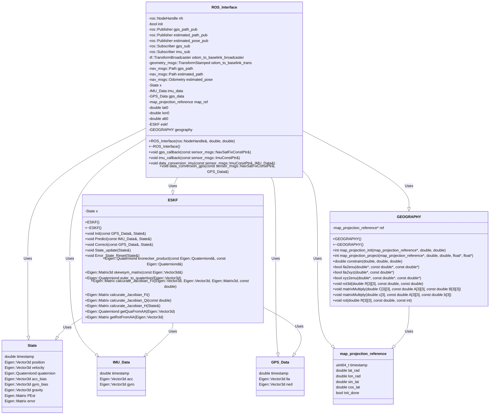

# gnss_imu_odom_ESKF
gnss imu odometry sensor fusion localization by ESKF(output NED pose)  

- [x] gnss imu sensor fusion localization by ESKF  
- [ ] gnss imu odometry sensor fusion localization by ESKF  

# Environment
OS : Ubuntu MATE with Raspberry pi4(8GB)  
ROS : noetic

# Input Output(IO)
## Input
- nmea messages /nmea_sentence(nmea_msgs/Sentence)
- gps messages /fix(sensor_msgs/NavSatFix)
- imu messages /imu/data(sensor_msgs/Imu)
- odom messages /odom(geometry_msgs/Pose)

## Output
- estimatid_pose messages /estimatid_pose(geometry_msgs/Pose)
- estimatid_path messages /estimatid_path(nav_msgs/Path)

# Software architecture
- gps trajectory plotter


- imu gnss sensor fusion


- odom imu gnss sensor fusion


# Class Diagram



# nmea_navsat_driver
## STEP1  Install nmea_msgs

```
cd catkin_ws/
cd src/
git clone https://github.com/ros-drivers/nmea_msgs
catkin_make
source ~/catkin_ws/devel/setup.bash
```
## STEP2 Install nmea_navsat_driver

```
cd catkin_ws/
cd src/
git clone https://github.com/ros-drivers/nmea_navsat_driver
catkin_make
source ~/catkin_ws/devel/setup.bash
```

## STEP3 Install rosbag file

https://epan-utbm.github.io/utbm_robocar_dataset/

utbm_robocar_dataset_20190131_noimage.bag (1.5 GB) 

2019-01-31 (Fri, snow) 	08:54-09:10 (15'59") 	1 × Velodyne / ibeo / SICK / IMU / GPS / Bumblebee XB3 / fisheye

## STEP4 rosbag play
### Terminal1
```
cd catkin_ws/
source ~/catkin_ws/devel/setup.bash
roslaunch gnss_imu_odom_ESKF eskf_localization.launch
```
### Terminal 2
```
rosbag play --clock Downloads/utbm_robocar_dataset_20190131_noimage.bag
```
### Terminal3
```
cd catkin_ws/
source ~/catkin_ws/devel/setup.bash
rostopic echo /nmea_sentence
```
### Terminal4
```
cd catkin_ws/
source ~/catkin_ws/devel/setup.bash
rostopic echo /fix
```

# gps_trajectory_plotter
```
cd catkin_ws/
source ~/catkin_ws/devel/setup.bash
roslaunch gnss_imu_odom_ESKF gps_trajectory_plotter.launch 
```
### result in rviz


# eskf_localization
## gnss imu sensor fusion
- [x] gnss imu sensor fusion localization by ESKF  
```
cd catkin_ws/
source ~/catkin_ws/devel/setup.bash
roslaunch gnss_imu_odom_ESKF imu_gnss_eskf_localization.launch
```
### result in rviz
- the green path is made by raw GPS
- the blue path is made by ESKF


## gnss imu odom sensor fusion 
- [ ] gnss imu odom sensor fusion localization by ESKF  
```
cd catkin_ws/
source ~/catkin_ws/devel/setup.bash
roslaunch gnss_imu_odom_ESKF odom_imu_gnss_eskf_localization.launch
```
### result in rviz
- the green path is made by raw GPS
- the red path is made by raw Odometry
- the blue path is made by ESKF


### problem section with outlier
Todo outlier fix


# Tsukuba Challenge Environment
## STEP1
```
roslaunch gnss_imu_odom_ESKF gnss_convert_path.launch 
```

## STEP2 
```
roslaunch gnss_imu_odom_ESKF gnss_path_publish.launch
```


